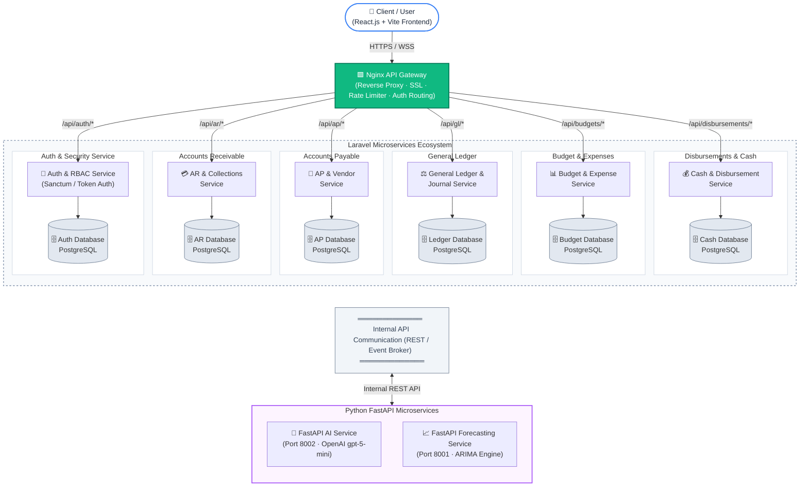

# Financial Management System — Microservices Architecture Diagram

> **Defense Presentation Guide**: This architecture diagram depicts the system using the canonical **Database-per-Service Microservices Pattern**, featuring an **Nginx API Gateway**, decentralized domain microservices with isolated PostgreSQL databases, asynchronous and synchronous internal communication, and dedicated Python FastAPI analytics services.

---

## 1. System Architecture Diagram

---

## 2. Component Breakdown

| Tier | Component | Technology | Responsibility |
|---|---|---|---|
| **Presentation** | Client / Web App | React 19 + Vite + Tailwind | Responsive UI, state management, client-side caching |
| **Edge / Gateway** | API Gateway | Nginx | Reverse proxy, SSL termination, path-based routing, rate limiting, CORS |
| **Service 1** | Auth & Security Service | Laravel | User credentials, role-based access control (RBAC), tokens |
| **Service 2** | Accounts Receivable Service | Laravel | Invoices, customer billing, collections, aging reports |
| **Service 3** | Accounts Payable Service | Laravel | Vendor bills, vouchers, supplier tracking, purchase obligations |
| **Service 4** | General Ledger Service | Laravel | Chart of accounts, journal entries, balance sheet, trial balance |
| **Service 5** | Budget & Expense Service | Laravel | Department allocation, health tracker, operational expenditures |
| **Service 6** | Cash & Disbursement Service | Laravel | Check issuance, bank reconciliations, cash account balances |
| **Data Tier** | Database-per-Service | PostgreSQL 16 | Dedicated schema and database storage per service to ensure high cohesion and loose coupling |
| **AI & Analytics** | AI Advisor & Forecasting | FastAPI (Python) | High-speed async inference for LLM advisor (`gpt-5-mini`) and statistical ARIMA time-series forecasting |

---

## 3. Defense Talking Points (Panel Q&A Guide)

### Q1: *"Why do you have a separate database for each service?"*
> **Answer**: *"We follow the industry-standard **Database-per-Service pattern**. This guarantees **loose coupling**—no service can directly query or modify another service's private tables. If the Accounts Receivable schema changes, it does not break the General Ledger service. Data integrity is maintained strictly through APIs."*

### Q2: *"How do services communicate with each other?"*
> **Answer**: *"We utilize **Internal REST API communication** over a secured container network. When a transaction completes in Disbursements, it dispatches an event/API payload to the General Ledger service to create the corresponding journal entry."*

### Q3: *"Why are the AI and Forecasting services built in Python FastAPI instead of Laravel?"*
> **Answer**: *"Python is the industry benchmark for data science and AI integration. FastAPI provides native asynchronous non-blocking I/O (`async`/`await`), which is critical when waiting for LLM token completions from OpenAI and running matrix computations for ARIMA forecasting without freezing PHP worker threads."*

### Q4: *"What is the role of the Nginx API Gateway?"*
> **Answer**: *"The API Gateway acts as the single point of entry for the client frontend. It shields our internal microservices from direct public exposure, handles SSL/TLS termination, routes requests by path (e.g., `/api/ar/*` to AR Service), and enforces uniform CORS and rate-limiting policies."*
